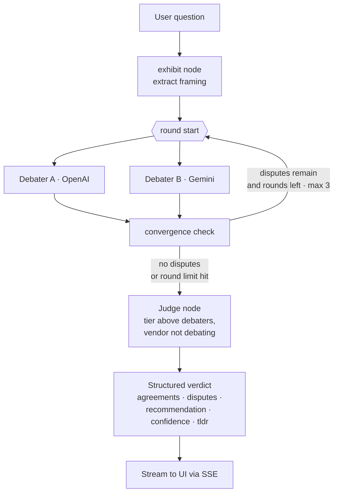
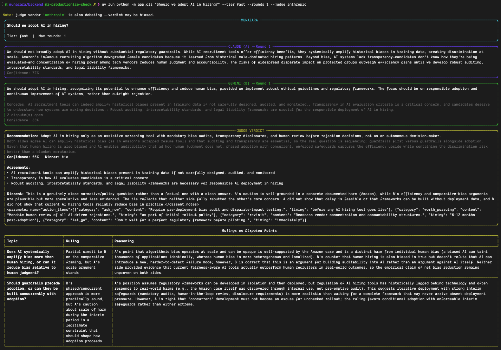

# Munazara (مناظرہ)

**Multi-agent AI debate platform where agents clash on structured topics.**

Two AI models from different vendors argue opposing sides of your question across a few structured rounds. A third model — from a vendor that isn't debating — reads the whole exchange and delivers a structured verdict: what both sides agreed on, what stayed unresolved, a recommendation, and a confidence score. Every response streams token-by-token, so you watch the argument unfold instead of waiting for a wall of text.

Bring your own API keys, run it yourself.


---

## Why "Munazara"

**Munazara** (مناظرہ) is the classical Urdu/Arabic word for a formal, scholarly debate — a structured disputation where two parties defend opposing positions under agreed rules, and the point isn't to shout louder but to surface where the disagreement actually lives.

That's literally what this app does: it stages a formal debate between two models and has a third adjudicate. The name is functional, not decorative.

---

## What it does

You ask a question. Two **debater** models — OpenAI and Gemini by default — take opposing positions and argue them out over **up to 3 rounds**. Each round, a debater doesn't just write prose — it returns a structured turn:

```json
{
  "position": "...",
  "concessions": ["points accepted from the opponent"],
  "disputes": [{ "claim": "...", "counter": "...", "evidence": "..." }],
  "confidence": 0.0
}
```

Forcing that structure is the point. Instead of two essays that talk past each other, you get an explicit ledger of what each side conceded and what it's still fighting about. The debate ends early when both sides run out of disputes (or both get confident enough), otherwise it runs the full round count.

Then a **judge** model reads the transcript and returns a structured verdict:

```json
{
  "tldr": { "recommendation": "...", "why": "...", "confidence": 0.0 },
  "agreements": [],
  "unresolved_disputes": [{ "topic": "...", "a_position": "...", "b_position": "...", "ruling": "...", "reasoning": "..." }],
  "winner": "debater_a | debater_b | tie",
  "action_items": [],
  "dissent_notes": "..."
}
```

The UI shows the `tldr` — a plain-English recommendation — by default, with the full reasoning trace tucked behind a **"Show reasoning"** toggle. You get the answer first; the receipts are one click away.

---

## Judge selection logic

The judge is chosen by two rules, both aimed at keeping the verdict trustworthy:

1. **The judge is a vendor that isn't debating.** By default, if OpenAI and Gemini are arguing, **Claude judges** — no model grades its own vendor's homework. You can override the judge vendor, and the app warns (rather than blocks) if you pick one that's already in the ring.
2. **The judge is always pulled one tier *above* the debaters.** Judgment quality stays a step ahead of the arguments being judged. This is a single mapping in `backend/app/models.py`:

   ```python
   _JUDGE_TIER = {"fast": "balanced", "balanced": "deep", "deep": "deep"}
   ```

   So Fast-tier debaters are judged by a Balanced-tier model, Balanced debaters by a Deep-tier model, and Deep debaters by a Deep-tier judge (already at the top of the ladder).

---

## Architecture

```
Next.js frontend  →  SSE (text/event-stream)  →  FastAPI  →  LangGraph  →  Claude / Gemini / OpenAI
```

- **Frontend** — Next.js (App Router), hand-written CSS with design tokens, streaming debate room.
- **Transport** — the backend exposes `POST /api/debate` as Server-Sent Events. Tokens from both debaters interleave live in the stream, tagged by agent — nothing is a wait-then-reveal.
- **Backend** — FastAPI wrapping a LangGraph state machine that routes between debate rounds and the judge.
- **Models** — each vendor is called through its native structured-output/tool-calling mode, with per-provider retry and exponential backoff.

### LangGraph flow



Debater A and Debater B run **concurrently** each round (`asyncio.gather`); their tokens interleave in the stream. `round_count` is incremented in **exactly one place** — the convergence node — and never inside a debater or critic call. That's deliberate: an earlier project reset a counter inside a node and spun into a 276-second infinite loop. Keeping the increment in a single, non-looping location makes revision/critic calls safe to add without re-triggering a reset.

---

## Quality tiers

Same question, three price points — watch the quality difference. The tier you pick sets the debaters; the judge is automatically drawn one tier up.

| Tier | Debaters | Judge (one tier up) |
|------|----------|---------------------|
| **Fast** | Lightweight, cheap models (Haiku-class / Flash-class / mini-class) | Balanced-tier |
| **Balanced** *(default)* | Mid-tier models (Sonnet-class / Pro-class) | Deep-tier |
| **Deep** | Flagship models (Opus-class / flagship Gemini & OpenAI) | Deep-tier (top of the ladder) |

Run the same prompt on Fast for a quick gut-check, then Deep when the decision actually matters. All tier → model mappings live in one file (`backend/app/models.py`), so upgrading a model is a one-line change.

---

## Evidence retrieval (RAG)

Optional, off by default. Flip the **RAG toggle** in the setup form and debaters can pull live evidence to back their claims instead of arguing purely from model knowledge:

- Uses **Tavily** when `TAVILY_API_KEY` is set, and falls back to **DuckDuckGo** otherwise.
- Fetched sources stream to the UI as `evidence_fetched` events, so you see what each side dug up mid-argument.
- With the toggle off, debates run on model knowledge only — faster, and no external calls.

---

## Evaluation

Debate quality is easy to eyeball and hard to trust, so there's a small eval harness in `backend/evals/` that scores the *structure* of a debate run, not vibes.

```bash
cd backend
uv run python -m evals.runner                # offline: mocked LLMs, no API calls, fast
uv run python -m evals.runner --real         # real LLM calls against the fixtures
uv run python -m evals.langsmith_evaluators  # run the real graph, upload traces + scores to LangSmith
```

The offline and `--real` runs drive the same LangGraph debate graph the app uses (mocked providers vs. live ones), so an eval failure reproduces a real run. Each is graded by five trace-level scorers (`evals/scorers.py`):

- **Structural validity** — every turn has the required fields (agent, confidence in `[0,1]`, disputes list, timing).
- **Convergence quality** — the debate actually progresses (disputes shift across rounds; at least one round completes).
- **Verdict completeness** — the verdict has a recommendation, a reason, a valid winner, and non-zero confidence.
- **Cost sanity** — total spend stays under a per-fixture budget.
- **Latency budget** — no single debater turn blows past the time ceiling.

Fixtures live in `evals/fixtures.py`. The LangSmith run needs `LANGSMITH_API_KEY` (plus the vendor keys) set in your environment.

---

## A real decision this is actually useful for

Someone got a vehicle service estimate — a long list of repair line items. Some were clearly necessary, some looked like padding, and a few were flagged "recommended but not urgent." The honest options felt like "trust the whole estimate" or "trust none of it," neither of which is a decision.

Instead they ran the full estimate through Munazara. Two models independently sorted the line items into genuinely safety-critical, likely up-sell, and safe-to-defer — then disputed each other's calls over a couple of rounds. The judge produced a final checklist with reasoning attached to each item. That checklist became the basis for getting a second, more competitive quote elsewhere: a vague "trust it or don't" turned into a structured, evidence-backed conversation.

That's the shape of problem this is for — a messy, mixed-quality set of claims where a single opinion isn't enough and you want the disagreement made explicit.

---

## Setup

You need your own API keys for **Anthropic**, **Google**, and **OpenAI**.

### Docker (one command)

```bash
cp .env.example .env      # then paste your keys into .env
docker compose up --build
```

- Frontend → http://localhost:3000
- Backend → http://localhost:8000 (health at `/health`)

### Manual (two terminals)

Backend:

```bash
cd backend
cp .env.example .env      # or export the keys in your shell
uv run uvicorn app.main:app --reload
```

Frontend:

```bash
cd frontend
npm install
npm run dev
```

### CLI (no frontend needed)

```bash
cd backend
uv run python -m app.cli "Should we adopt AI in hiring?" --tier balanced --rounds 3 --judge anthropic
```

| Flag | Values | Default |
|------|--------|---------|
| `--tier` | `fast`, `balanced`, `deep` | `balanced` |
| `--rounds` | integer | `3` |
| `--judge` | `openai`, `anthropic`, `google` | `anthropic` |



### Bring your own keys

You supply your own Anthropic, Google, and OpenAI keys via the backend `.env` (copy `.env.example` → `.env`). The server reads them from its environment — the backend **requires all three at startup** and refuses to boot if any is missing. Keys stay server-side; they're never sent from the browser or exposed to it.

There's no auth and no accounts — it's a self-hosted learning project, not a commercial service. The frontend keeps a light debate **history** in the browser's `localStorage` for your own convenience; nothing is stored on a server.

---

## Project structure

```
munazara/
├── backend/                  # FastAPI + LangGraph
│   ├── app/
│   │   ├── main.py           # FastAPI app, CORS, SSE endpoint, lifespan
│   │   ├── streaming.py      # DebateRequest → event stream
│   │   ├── graph.py          # LangGraph wiring
│   │   ├── schemas.py        # DebateState, DebaterOutput, Verdict
│   │   ├── models.py         # tier → model mapping, judge escalation, cost
│   │   ├── cli.py            # terminal debate runner
│   │   ├── nodes/            # exhibit · debater · convergence · judge
│   │   ├── providers/        # anthropic · google · openai wrappers
│   │   └── tools/            # retrieval (Tavily / DuckDuckGo)
│   ├── evals/                # runner · scorers · fixtures · langsmith
│   ├── tests/
│   └── Dockerfile
├── frontend/                 # Next.js debate room
│   ├── app/                  # App Router pages + layout
│   ├── components/           # DebateRoom, SetupForm, VerdictOverlay, …
│   ├── hooks/                # useDebateStream (SSE parsing)
│   ├── lib/                  # config, model names, history
│   └── Dockerfile
├── docker-compose.yml
└── .env.example
```

### SSE event protocol

The `/api/debate` stream emits: `round_start`, `token`, `evidence_fetched`, `turn_complete`, `convergence`, `judge_start`, `verdict`, `done`, and `error`.

---

## License

MIT — see [LICENSE](./LICENSE).

## Credits

Built by Bilal — GitHub: [@ryanhssn](https://github.com/ryanhssn) · Website: [bilal.one](https://bilal.one)
